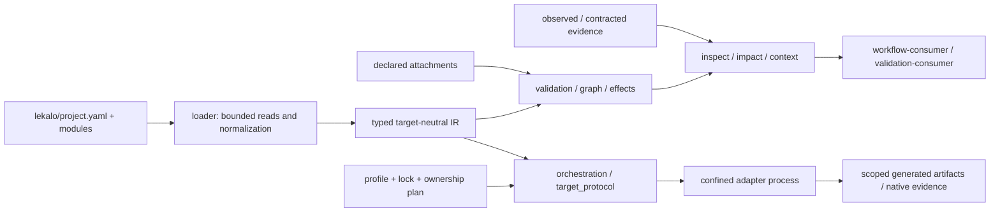

# Architecture

Status: **Implemented** bounded services, checked against product 0.6.3 at base `a56ee578`. Owner: core and adapter-host maintainers. [Research](m7/issue-105-research.md), [IR ADR](adr/0007-ir.md), [orchestration ADR](adr/0038-generate-verify-orchestration.md), [issue #105](https://github.com/ichinya/lekalo/issues/105).

Lekalo describes one application model for multiple targets. The semantic model records application meaning; a target decides how its supported slice maps into a language/framework. A configured target is not proof that every operation is supported.



The CLI in `crates/lekalo-cli` selects inputs, delegates decisions and renders `DomainResult`. Pure semantic services live in `crates/lekalo-core`; core also contains bounded filesystem/process/storage services (`project_fs`, `target_protocol`, orchestration, package management and local history). Do not assume all core calls are free of I/O.

The loader validates physical structure, parses YAML/JSON, resolves imports and produces normalized Model. IR compilation resolves typed semantics. Dependency/effect graphs and projections use accepted IR plus explicitly supplied attachments/evidence; they do not infer domain meaning from arbitrary source names. [Model and glossary](model.md#glossary), [loader](loader.md), [IR](ir.md), [graph](graph.md), [effects](effect-graph.md).

## Projection example

**Implemented.** From a disposable copy of `tests/fixtures/contracted/planner-slice`, with the built `lekalo` on PATH:

```sh docs-example=inspect-planner
lekalo --no-cache --json inspect planner.focus_task
lekalo --no-cache --json impact planner.focus_task
lekalo --no-cache --json context planner.focus_task --budget 5000
```

Each exits 0 on stdout with a valid typed projection; inspect resolves exactly `planner.focus_task`, impact identifies affected symbols, and context exposes its budget, estimator and excluded-fact manifest. Partial evidence and gaps remain explicit. A Model declaration span is not the source location of a maintained implementation. `fits` is a bounded structural result, not measured AI understanding.

## Execution boundaries

Generation passes through explicit profile/capability/lock/ownership checks and a plan/apply protocol. An adapter operates in a confined staged view; core verifies declared outputs and rechecks real before-state before publishing admitted changes. [Target protocol](target-protocol.md), [orchestration](orchestration.md), [ownership manifest](artifact-manifest.md), [security](security.md).

Native gate planning is **Implemented**. Production `native run` execution is **Planned** and currently gives a typed refusal; test harnesses execute explicitly trusted synthetic native fixtures. Readiness evaluates supplied evidence and does not automatically run a validation-consumer.

Workflow-provider discovery is a separate **Implemented** metadata contract, not an adapter execution transport. A workflow-consumer owns its QA envelope; a validation-consumer owns its results. [Authority](authority.md), [integrations](integrations.md).

## Documentation ownership

[documentation-owners.json](documentation-owners.json) assigns one primary reference owner to each CLI command/group/global, contract file and exported protocol shape. The inventory includes older files with exact producer/manifest selection: existence is not current-version admission. [CLI command index](cli.md#command-index) contains the real help synopsis for every nested command.

`scripts/test-docs-ownership.mjs` checks live recursive help, exact contract bytes, adapter wire identities, pages, glossary and links; `--static` checks source/contract drift without a binary. A new command/schema/protocol must add its owner and content in the same change. `scripts/update-docs-owners.mjs --write` is an explicit maintenance operation; CI never regenerates an inventory to hide drift.

## Documentation coverage

[The example registry](../tests/fixtures/docs/examples.json) binds displayed blocks to real argv and disposable fixture roots. [Example gate](../scripts/test-docs-examples.mjs) executes the commands, checks result status/streams/schema/semantic assertions and input preservation. It reuses the synthetic planner corpus and separate [MySQL fixture](../tests/fixtures/pilot/brownfield-mysql/README.md). The suite catalog and descriptor protocol are maintained by [fixture-catalog.mjs](../scripts/lib/fixture-catalog.mjs), not Model authority.

**Experimental:** the brownfield contributor harness can use a direct-kernel fallback after a recorded scan-wire refusal. **Planned:** aggregate public metrics export (#102). See [roadmap](roadmap.md) for scope, external qualification limits and versioned documentation.
